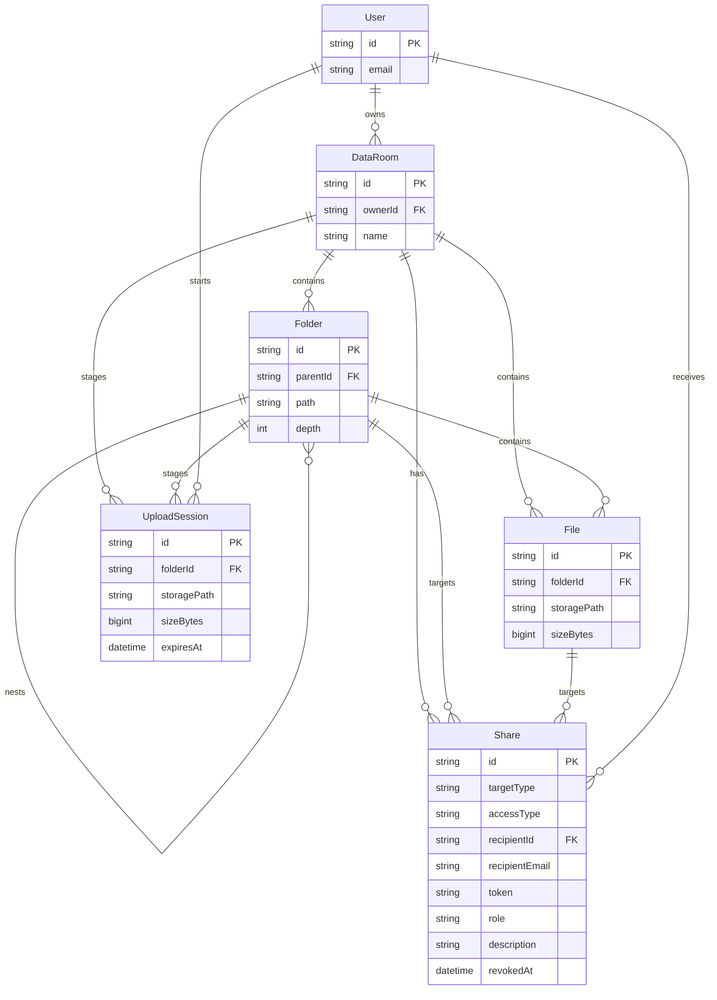

# Acme Data Room

A full-stack virtual Data Room MVP for securely organizing, viewing, downloading, and sharing due-diligence PDFs.

## Stack

| Area | Technology |
| --- | --- |
| Web app | React, TypeScript, Vite, Tailwind CSS |
| API | NestJS, Prisma |
| Database | Supabase PostgreSQL |
| Authentication | Supabase Auth with Google OAuth and email/password |
| File storage | Private Supabase Storage bucket |
| Workspace | pnpm monorepo |

## Implemented functionality

- Google OAuth plus email/password sign-up and sign-in, with owner-isolated Data Rooms.
- Create, rename, and delete Data Rooms.
- Nested folders with breadcrumbs, a lazy-loaded collapsible tree sidebar, rename, deletion warning, subtree deletion, and cursor-paginated folder listings with page controls.
- PDF uploads: picker or drag-and-drop, up to 10 files and 25 MB per file, direct-to-storage upload with individual progress, collision-safe names.
- Debounced Data Room-wide file-name search with cursor pagination; it starts at three characters to keep broad substring searches responsive.
- File preview inside the app, download, rename, delete, and drag-and-drop moves between folders or Data Rooms.
- Public links for a Data Room, folder, or individual file; every link is read-only, supports an optional description, and can be revoked.
- Permissioned read-only sharing for a specific Google account. The recipient sees shared items in **Shared with me** and has no access above a shared folder in the hierarchy.
- Signed URLs for file preview/download are created only after API authorization and expire after ten minutes.

## Local setup

### 1. Configure Supabase

1. Create a Supabase project.
2. Enable **Email** in **Authentication → Providers**. We recommend keeping **Confirm email** enabled, and configure an SMTP provider before production.
3. Enable **Google** in **Authentication → Providers** and configure its OAuth client if you want Google sign-in too.
4. Add `http://localhost:5173` to **Authentication → URL Configuration → Redirect URLs**. Email confirmation links return to this URL.
5. Run [`supabase/migrations/0001_storage.sql`](supabase/migrations/0001_storage.sql) in the Supabase SQL editor. It creates the private `data-room-files` bucket and its policies.
6. Copy [`.env.example`](.env.example) into both `apps/api/.env` and `apps/web/.env`.

Use these values:

- `SUPABASE_URL`, `SUPABASE_ANON_KEY`, `VITE_SUPABASE_URL`, `VITE_SUPABASE_ANON_KEY`: Supabase **Project Settings → API**.
- `SUPABASE_SERVICE_ROLE_KEY`: Supabase **Project Settings → API**. Keep it only in `apps/api/.env` and deployment API variables—never expose it as `VITE_*`.
- `DATABASE_URL`: Supabase **Connect** transaction-pooler URL, with `pgbouncer=true`.
- `DIRECT_URL`: Supabase **Connect** direct URL, used by Prisma migrations.
- `VITE_API_URL`: `http://localhost:3000/api` locally.
- `WEB_ORIGIN`: optional locally; set it to the frontend deployment URL in production.
- `UPLOAD_CLEANUP_SECRET`: add this long random value only to `apps/api/.env` and the API host's environment variables. It authenticates the scheduled cleanup request and must never be added to `apps/web/.env` or a `VITE_*` variable.

### 2. Install, migrate, run

```bash
pnpm install
pnpm db:generate
pnpm db:migrate
pnpm dev
```

Open `http://localhost:5173`. The Nest API listens at `http://localhost:3000/api`.

Permissioned sharing can be granted to any email address. If the recipient has not registered yet, the invitation is marked pending and is automatically attached to their account on first Google or email/password sign-in; no service-role key is ever sent to the browser.

## Deployment

Deploy `apps/web` to Vercel and `apps/api` to a Node-capable host such as Railway, Render, or Fly.io.

1. Configure the API with `SUPABASE_URL`, `SUPABASE_SERVICE_ROLE_KEY`, `DATABASE_URL`, `DIRECT_URL`, `PORT`, and `WEB_ORIGIN=https://<your-web-domain>`.
2. Configure the web app with `VITE_SUPABASE_URL`, `VITE_SUPABASE_ANON_KEY`, and `VITE_API_URL=https://<your-api-domain>/api`.
3. Add the production web URL to Supabase Auth redirect URLs and to the Google OAuth client’s authorized redirect origins.
4. Run `pnpm db:migrate` against production before releasing the API.
5. Generate a long random `UPLOAD_CLEANUP_SECRET`, set it on the API host, replace the two placeholders in [`supabase/migrations/0002_schedule_expired_upload_cleanup.sql`](supabase/migrations/0002_schedule_expired_upload_cleanup.sql), then run that script in the Supabase SQL editor. It stores the API URL and secret in Vault and uses Supabase Cron plus `pg_net` to invoke the cleanup every hour.

The resulting job is named `cleanup-expired-uploads`. Monitor its scheduling in **Integrations → Cron** and inspect the HTTP response from `pg_net` in the SQL editor when investigating a failed run.

## Design decisions

- **Authorization is server-side.** The API validates the Supabase access token before every owner or permissioned-share request, syncs only the authenticated user ID/email, and derives access from a non-revoked `Share` row.
- **Private storage and uploads.** PDFs stay in a private bucket. The API authorizes access and returns short-lived view/download URLs only for allowed files. For uploads, it creates a one-file signed upload URL after checking ownership, folder, file name, and size; the browser sends the bytes directly to Storage and the API verifies the stored object before publishing its `File` record. This avoids buffering files in the API while retaining per-file browser progress.
- **Expired uploads.** A Supabase Cron job calls a separately authenticated maintenance endpoint hourly. It processes at most 500 expired sessions per run in batches of 100, removes each object with the Storage API, and only then deletes its metadata row. Failed batches remain eligible for the next idempotent run.
- **Scoping.** A share targets one Data Room, folder, or file. Folder access is checked with the shared folder’s materialized `path`, so a recipient can traverse descendants but never parents or siblings.
- **Names.** Folder names are unique within a parent. File collisions resolve to the next available suffix on upload, rename, and move.
- **Revocation.** Revoking sets `revokedAt`; all permissioned and public read endpoints check it before returning metadata or a signed file URL.

## Data model / ERD



`Folder.path` is a materialized path such as `/folder-a/folder-b/`. `Share.targetType` identifies whether `folderId`, `fileId`, or the Data Room itself is the scope. `Share.accessType` distinguishes `PUBLIC_LINK` from a permissioned `USER` grant; `Share.role` is already an enum with `VIEWER` and `EDITOR`.

## How this scales

### Total size and item count of a folder subtree

For small and medium folders, aggregate `COUNT(*)` and `SUM(sizeBytes)` for files whose folders have a `path` beginning with the target folder path. The existing `(dataRoomId, path)` index keeps this scoped. At larger scale, add a `FolderStats` projection containing recursive item counts and bytes; update every ancestor in the same metadata transaction and reconcile asynchronously for safety.

### One Data Room with 100,000 files

Never fetch every file in a folder. The API lists only direct children in stable folder-first order with a keyset cursor (`kind`, `name`, `id`) and a bounded page size of 50 by default (100 maximum). The UI exposes Previous/Next and numbered controls for already visited cursor pages. Matching `(dataRoomId, parentId/folderId, name, id)` B-tree indexes support both the scope predicate and cursor comparison. The sidebar fetches only root folders initially and fetches each branch when it is expanded; the full folder-options list is requested only when the Move dialog opens. File-name search is server-side, debounced, Data Room-scoped, and cursor-paginated; a `pg_trgm` GIN index makes three-or-more-character substring queries scalable. Upload/deletion fan-out and stats reconciliation move to idempotent background jobs backed by an outbox.

### Extending sharing to viewer/editor roles

No data-model change is required: `Share.role` already stores `VIEWER` and `EDITOR`. Centralize authorization as an action-to-role check, allow `EDITOR` only for permissioned `USER` shares, and keep `PUBLIC_LINK` read-only irrespective of role. Future roles can be added to the enum or replaced with a capability table without changing share targets.

## AI usage

AI assisted with project scaffolding, React component composition, API endpoint boilerplate, Prisma schema iteration, and documentation. All generated code was reviewed locally; build, lint, migration, and protected-route checks were run during implementation.
