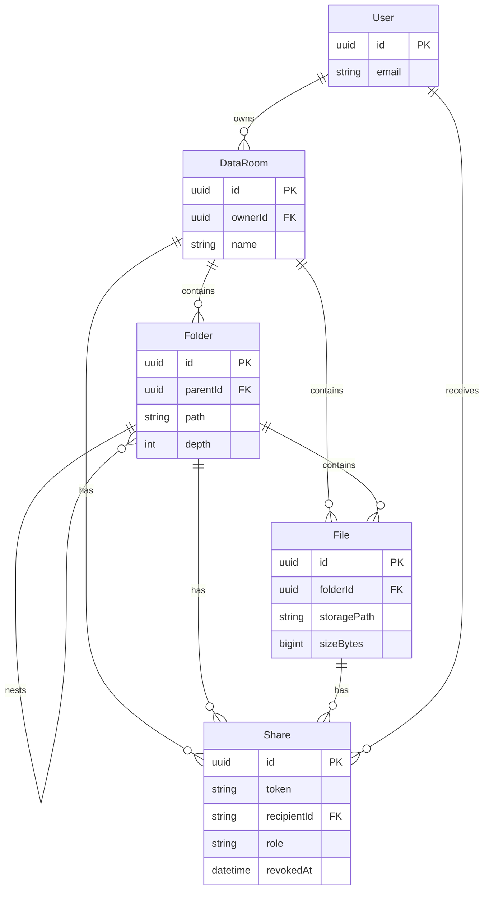

# Acme Data Room

A secure virtual Data Room MVP for organizing and sharing acquisition due-diligence documents. The repository is a pnpm monorepo:

| Package | Responsibility | Stack |
| --- | --- | --- |
| `apps/web` | Responsive browser UI | React, TypeScript, Vite, Tailwind |
| `apps/api` | Authorization and business rules | NestJS, Prisma, PostgreSQL |
| `packages/contracts` | Shared API/UI data shapes | TypeScript |
| Supabase | Auth, PostgreSQL, private blob storage | Supabase Auth / Storage |

## Current foundation

- Google sign-in through Supabase Auth.
- Owner-scoped Data Rooms: a signed-in user only sees rooms they own.
- Creating rooms, root folders, and arbitrarily nested folders.
- Folder content listing with ordered files/folders and breadcrumb navigation.
- Unique names are enforced per parent folder; a duplicate folder produces a clear error.
- API validates input and verifies Supabase access tokens server-side before any owner action.

The foundation intentionally does not show controls for flows that are not implemented yet; upload is the next implementation step.

## Local setup

### 1. Create Supabase services

1. Create a Supabase project.
2. In **Authentication → Providers**, enable Google and configure the Google OAuth client.
3. Add `http://localhost:5173` to Supabase **URL Configuration** redirect URLs.
4. Create the private Storage bucket by running `supabase/migrations/0001_storage.sql` in the Supabase SQL editor.
5. Copy `.env.example` to `apps/api/.env` and `apps/web/.env`. The web file only needs variables beginning with `VITE_`; keep `SUPABASE_SERVICE_ROLE_KEY` exclusively in the API environment.
   Set `DATABASE_URL` to Supabase's **Transaction pooler** URI (with `pgbouncer=true`) for application traffic, and `DIRECT_URL` to its **Direct connection** URI for Prisma migrations.

### 2. Install and run

```bash
pnpm install
pnpm db:generate
pnpm db:migrate --name init
pnpm dev
```

The frontend is at `http://localhost:5173`, and the API at `http://localhost:3000/api`.

For a hosted deployment, deploy `apps/web` on Vercel and `apps/api` in a container host (Railway, Fly.io, Render, or Supabase Edge Functions after an API adaptation). Set `WEB_ORIGIN` on the API to the Vercel URL and put all Supabase secrets only in deployment environment variables.

## Design decisions

- **Auth boundary:** Supabase manages Google OAuth and refresh tokens. The web sends the short-lived access token to Nest; the API validates its signature against Supabase’s JWKS. The browser never gets a service-role key.
- **Storage boundary:** files live in a private `data-room-files` bucket. The API authorizes access, uploads through a signed upload URL, and returns expiring signed download URLs. This avoids public bucket URLs and keeps permissions in one place.
- **Names and collisions:** folder/file names are unique at `(dataRoomId, parentId, name)`. On upload, the UI will offer “keep both” (suffix), replace as a new version, or cancel; simple renames show the collision error inline.
- **Deletion:** deleting a folder first queries its subtree and reports the number of folders, files, and bytes to be removed. The delete is transactional for metadata, followed by an asynchronous, retryable object-storage cleanup job. A viewer whose shared resource disappears receives a clear “no longer available” page rather than a broken file link.
- **Sharing:** every share points at one Data Room, folder, or file, has an access mode (`PUBLIC_LINK` or recipient `USER`), role, expiry and revocation time. Effective read access for a descendant follows its ancestors. Public tokens are random, unguessable identifiers and can be revoked immediately.

## Data model / ERD



`Folder.path` is a materialized path such as `/folder-a/folder-b/`; it makes subtree reads and descendant permission checks predictable without recursive application loops. `depth` protects against pathological nesting and supports UI limits.

## How this scales

### Total size and item count of an entire folder

For immediate feedback on small/medium trees, aggregate rows whose folder path begins with the selected folder’s `path` plus files directly in those folders: `COUNT(*)` and `SUM(sizeBytes)`. PostgreSQL gets an index on `(dataRoomId, path)`. At sustained scale, maintain `FolderStats(folderId, recursiveFileCount, recursiveFolderCount, recursiveBytes)` transactionally for each ancestor on every write; a periodic reconciliation job detects drift. The UI reads the precomputed stats, never scans a huge subtree on deletion.

### A Data Room with 100,000 files

The UI lists only direct children, never a full tree. Use cursor/keyset pagination ordered by `(name, id)` (or `(updatedAt, id)`), `take: 100`, and a matching composite index `(dataRoomId, folderId, name, id)`. Fetch folder and file rows separately, merge the two bounded pages, or model a unified `Node` table if a single mixed ordering becomes a bottleneck. Debounced search should be server-side, scoped by `dataRoomId`, and use a trigram/GIN index for name matching. Large uploads and deletes become background jobs with idempotency keys and an outbox table.

### Roles without a remodel

`Share.role` already has `VIEWER` and `EDITOR`. Add roles such as `DOWNLOADER`, `MANAGER`, or a bitmask/policy table later without changing targets or relations. Authorization maps roles to actions centrally; `USER` shares can grant editor capabilities, while `PUBLIC_LINK` stays view-only regardless of its stored role.

## Delivery roadmap

1. **Next:** upload endpoint with MIME/size validation, signed Supabase upload URL, multi-file drag/drop and per-file progress; PDF viewer from a signed download URL.
2. Rename/move/delete files and folders, including a destructive-operation preview modal and storage cleanup worker.
3. Public-link and recipient sharing screens, revocation, and a read-only shared route.
4. Search, audit events, background jobs, tests, rate limits, observability, and deployment CI.

## AI usage

AI was used to accelerate the initial project scaffold, component composition, Prisma schema, and documentation. All security boundaries, data-model decisions, and generated code should be reviewed, tested, and exercised against a real Supabase project before production use.
